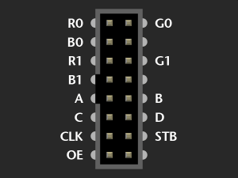

# ledmatrix-nodemcu
LED matrix display panel driven by nodemcu (or Wemos D1mini) controller

## DATA_IN, DATA_OUT connection

| DATA_IN | DATA_OUT | color |
| ------- | -------- | ----- |
| R1 | R0 | lila |
| G0 | R1 | schwarz |
| G1 | G0 | weiss |
| B0 | G1 | grau |
| B1 | B0 | blau |

## MQTT interface

Topics

/Command
/status

[
    {
    "cmd": "brt"|"clr"|"gau"|"lin"|"pnt"|"rct"|"txt"
    "x": 
    "y":
    "x2":
    "y2":
    "col": name or "#RRGGBB"
    "txt": text
    "brt":
    },
    {
        ...
    },
    ...
]
